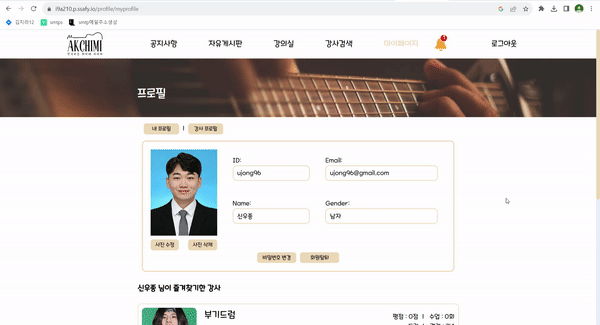

# 시연 시나리오

## 메인페이지

### 메인페이지 강사 검색

- 메인페이지의 악기 아이콘 클릭하면 악기 필터가 적용된 강사 검색

## 회원가입

- 아이디 6~12자 제한, 중복확인
- 비밀번호 8~20자, 특수문자, 영어 대문자 필수
- 이메일 중복확인
- 모든 form 입력 필수

## 로그인

- 아이가 존재하는지 확인
- 비밀번호가 일치하는지 확인

## 공지사항

### 공지사항 목록 및 검색

- 전체, 제목, 내용을 필터로 공지사항 글 검색

### 공지사항 작성

- 관리자 계정으로 로그인시 공지사항 글작성 가능

### 공지사항 수정 및 삭제

- 관리자 계정으로 공지사항 글 수정 및 삭제 가능

## 자유게시판

### 자유게시판 목록 및 상세보기

- 자유게시판 한페이지 당 20개씩 게시글 페이징
- 글제목 클릭시 글 상세보기

### 자유게시판 정렬

- 최신순, 조회순 필터로 자유게시판 글 정렬

### 자유게시판 필터 검색

- 전체, 제목, 내용, 작성자를 필터로 자유게시판 글 검색

### 자유게시판 글 쓰기

- 로그인 유저는 자유게시판 글 작성 가능

### 자유게시판 글 수정, 삭제

- 글작성자는 글 수정, 삭제 가능

## 강사검색

### 강사검색 필터

- 성별, 악기종류, 경력, 비용, 시간 필터 적용하고, 검색어 입력후 강사 검색

### 강사검색 정렬

- 최신순, 별점순, 매칭순 필터 적용후 강사 검색

### 강사 상세페이지 및 즐겨찾기

- 강사 검색결과 자세히 보기에서 사용자들이 강사에 남긴 별점과 리뷰 보기 
- 강사 즐겨찾기 후 **마이페이지**에서 확인가능

### 강의 신청

- 검색결과 페이지나 마이페이지에서 강의 신청하면 **강의실의 배우기 > 대기중 탭**으로 이동

## 강의실

### 채팅

- 대기중이나 진행중인 강의에서는 대화내역이 저장되는 채팅을 통해 수업 관련 내용 공유

### 강의 수락

- 강의 신청을 받은 강사는 강의실의 **가르치기 > 대기중 탭**에서 수업을 수락하면 **진행중 탭**으로 이동

### 강의 메모

- 진행중이나 완료된 강의는 학생과 강사가 강의에 대한 메모 작성 가능 
- 학생과 강사가 작성한 메모의 내용은 서로에게 보이지 않음

### 완료된 강의 리뷰 작성

- 학생이 진행중인 강의를 완료하면 **완료탭**으로 이동

- 완료탭에서 강의에 대한 **리뷰와 별점**을 등록

### 내가 쓴 리뷰 보기

- 내가 쓴 리뷰 보기 버튼을 통해 리뷰 **수정과 삭제** 가능

## 라이브강의

### 라이브 강의 입장 및 채팅

- 대기화면에서 내화면 확인후 강의실 입장 
- 좌측의 **캠화면이나 공유화면을 클릭하면** 가운데 **메인화면으로 보여줌**
- 우측에서 대화내역이 저장되지 않는 채팅 가능

### 메트로놈

- 드래그바로 메트로놈의 박자 조절 가능

### 튜너

- 튜너 모달창에서 start 버튼을 누르고 기타 연주시 코드를 인식

### 화면 공유

- 화면 공유 버튼으로 내 PC 화면을 공유하거나 상대 PC 화면을 공유받음

## 마이페이지

- 마이페이지의 사진등록 / 수정 버튼을 눌러 사진 등록 및 수정

- 사용가능 악기, 경력, 시간당 비용, 요일, 시간 등 강사 정보 등록

- 강사 정보를 나타낼 수 있는 학위, 공연 사진 등 **이미지 첨부파일**을 추가해 강사등록 완료
